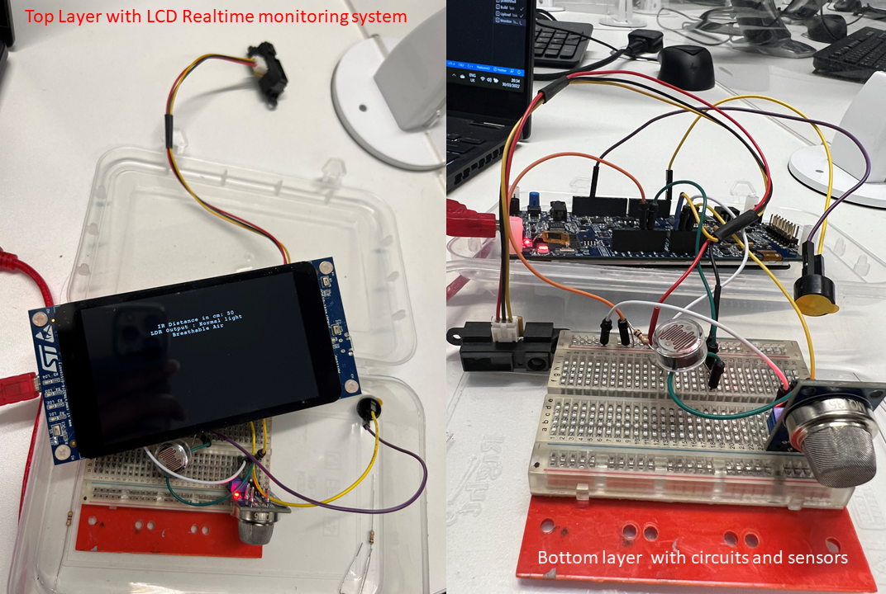
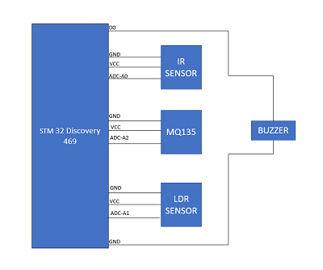
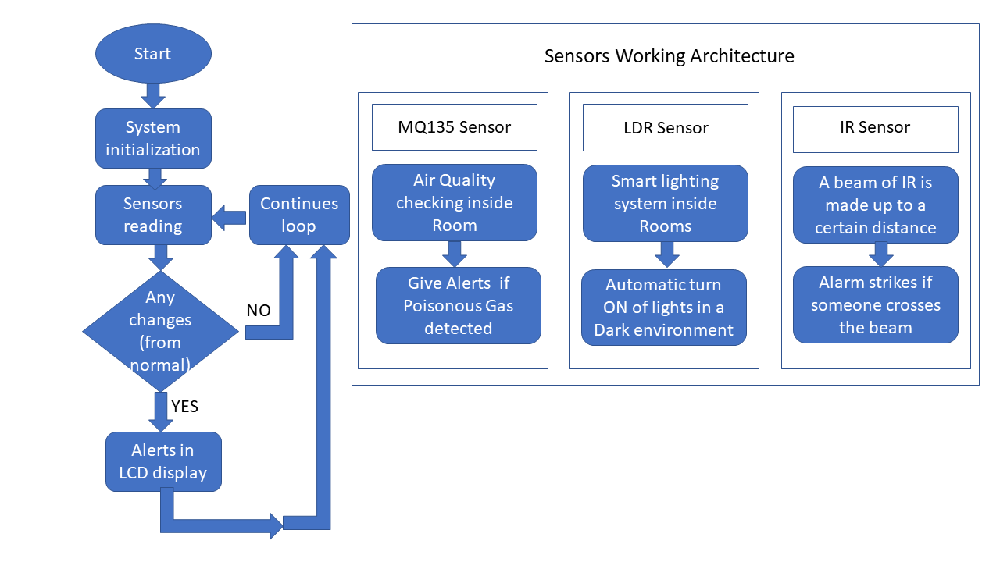

# 1: EMBEDDED SYSTEM PROPOSAL
## SMART HOME
---
The system we propose, an intelligent smart home system which alarm the tenants about the possible movement of intruders, intelligent lighting system as well as a poisonous gas detector inside the home. 

In our system prototype, we have three sensors attached.
- IR sensor which detects the movements.
- LDR sensor which can turn on or off light. 
- Gas sensor which detects poisonous gas levels. 

The system can be effectively integrated to a home, and it provides various security measures. If a possible intruder movement is detected, we can turn on the light in that specific area. 

IR sensor is tuned in a way that the buzzer beeps every time an intruder tries to cross the area. The prototype we designed has 43 cm as the boundary line. So, every time an object try to come closer than 43cm, the buzzer beeps.

LDR sensors are basically light sensors which resistance changes with light intensity falls on it.
We can develop intelligent lighting system which automatically turn on or off according to the light intensity available in a particular area.   

Poisonous gas leaking can detect with help of the MQ135 sensor. The air quality is measured and displayed in the screen.
# 2: HARDWARE DESIGN
---
## Components 
-   STM32F469I-Discovery board [datasheet](https://www.st.com/resource/en/user_manual/dm00218846-discovery-kit-with-stm32f469ni-mcu-stmicroelectronics.pdf)[pinout](https://os.mbed.com/platforms/ST-Discovery-F469NI/)
-   MQ135 [datasheet](https://www.electronicoscaldas.com/datasheet/MQ-135_Hanwei.pdf)
-   IR sensor [datasheet](https://global.sharp/products/device/lineup/data/pdf/datasheet/gp2y0a21yk_e.pdf)
-   LDR sensor [datasheet](https://components101.com/sites/default/files/component_datasheet/LDR%20Datasheet.pdf)
-   BUZZER [datasheet](https://www.farnell.com/datasheets/2171929.pdf)

## Hardware Block Diagram
 
- The MQ135 sensor is connected to the A2 port of the STM32469I board.IR sensor is connected to the A0 and LDR sensor is connected to the A1 port of the STM32469I board.Each sensor is connected to VCC and GND respectivily.D0 is the digital output pin connected to the buzzer.

    

# 3: EMBEDDED CODE IMPLEMENTATION AND ARCHITECHTURE
---
- Flow Chart

initialisation
- initialising and setting up display
- initialise variables
- initialise look up table for IR sensor
- calling MQ135 library

IR sensor
- setting up a threshold adc value
- compare current and threshold adc values

LDR 
- fixing  comparative adc value for luminous intensity
- compare it with real time value
- turn on led if fixed value less than current measurement

MQ135
- Clean air if adcRaw < 55
- air with co2 if adcRaw between 180 and 400
- Breathable air if adcRaw between 74 and 180
- propane and butane if adcRaw  > 400

lcd display
- intruder alert and distance in cm
- night mode or normal light
- air with co2, breathable air and propane and butane

# 4: EVALUATION
---
After implementation of the above system, it is evident that the sensors works fine simultaneously on a real time basis. The infrared sensor reads the distance in real time and when the distance measurement becomes lesser, that is someone tries to cross the boundary,  buzzer beeps and a messeage "Intruder alert"  printed on the lcd screen.

When the light intensity is greater than the set value, "Normal light" is printed on the lcd display of the discovery board. As soon as the light intensity goes down the threshold value, a led on the board which represents a bulb at home starts to glow, showing  "Night mode" on the screen simultaneously.

The MQ135 sensor used to measure the air quality.The sensor measures breathable air in home environment and whenever the presence of Co2 raises an optimum value, LCD screen shows "Air with CO2" message . We exposed some perfume/sanitizer nearer to the sensor and it displayed "propane and butane" on the screen since perfumes contain small traces of them.A potential LPG gas leak can effectivily monitered with help of this feature.

The real time implementation of these systems covers the main objective of a smart home helping the tenants to a large extent.

The proposed system features are limited as we can only provide the results locally. With more time for implementation, we can integrate ESP8266 module which help us for transmitting the data to a cloud and user can acesses them globally.
